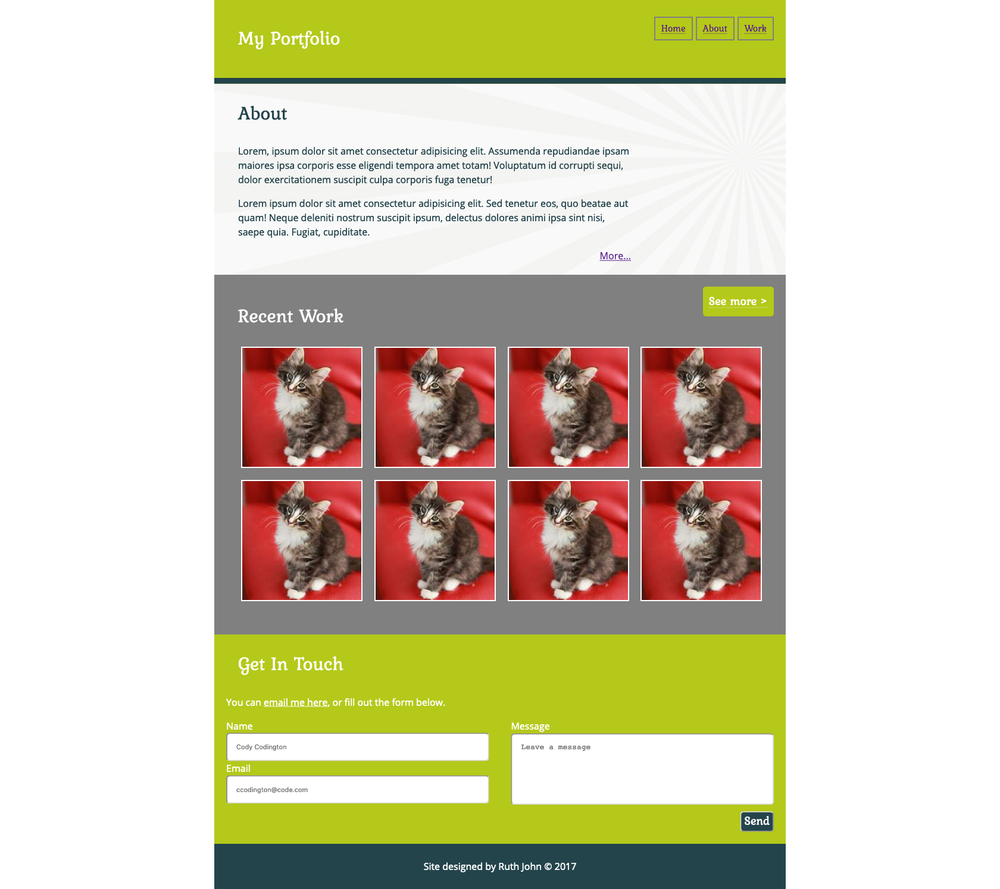

# DevelopMe_ Fellowship Coding Bootcamp - Week One
This is the first project created at the DevelopMe_ bootcamp. It is a simple, static one-pager, using HTML5 and CSS.

## Brief
The brief was to create the webpage from scratch, from a PDF design supplied by the instructor. The purpose of the challenge was to learn basic HTML, using the appropriate tags, inserting links and images, and styling the page using CSS with relevant selectors.

## Features
The webpage features:
*Basic HTML5 with relevant tags
*Basic CSS styling

## Screenshot

